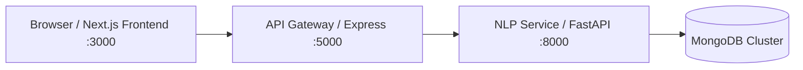
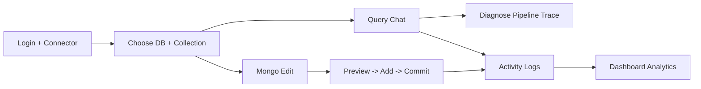

# NLP MongoDB Interface

Natural-language workspace for MongoDB with:
- Google-authenticated frontend
- Query chat with pipeline diagnosis
- Safe mutation workflow (preview -> add -> commit)
- Activity/diagnosis analytics dashboard

## Architecture



### Product flow



## Current features (from codebase)

- Google sign-in via NextAuth (`/api/auth/[...nextauth]`)
- Connector with Mongo URI input, database discovery, collection loading
- Query chat per `db/collection` with:
  - multi-session history (create/switch/rename/delete/search)
  - natural-language query execution
  - result table rendering
  - warnings and value hints
- Diagnostics:
  - stepwise pipeline trace (`0_raw_sample` -> `7_index_info`)
  - schema cache clear action
- Mongo Edit:
  - `manual` mode and `query` mode
  - mutation preview, affected-count estimation, sample impacted documents
  - explicit `Add` then `Commit` workflow
- Dashboard analytics:
  - activity overview (query/diagnose/commit)
  - commit timeline
  - diagnosis severity and health score trends

## Repository structure

```text
NLP MongoDB/
|- frontend/                       # Next.js app (UI + auth + pages)
|  |- app/
|  |  |- page.tsx                  # Landing
|  |  |- connector/page.tsx        # Connector workspace
|  |  |- chat/[db]/[collection]/   # Query chat
|  |  |- edit/[db]/[collection]/   # Mongo edit (mutations)
|  |  |- dashboard/page.tsx        # Analytics dashboard
|  |  `- api/auth/[...nextauth]/   # Google auth route
|  |- components/
|  |  |- chat-interface.tsx
|  |  |- chat-history-panel.tsx
|  |  |- mongo-edit-interface.tsx
|  |  |- diagnose-trace.tsx
|  |  `- dashboard/
|  |- context/                     # auth-context, app-context
|  `- lib/api/gateway.ts           # frontend -> gateway client
|- api_gateway/                    # Express proxy
|  |- server.js
|  |- routes/nlqRoutes.js
|  |- controllers/nlqController.js
|  `- config/nlpconfig.js
|- nlp_service/                    # FastAPI NLP + mutation + analytics service
|  |- app.py
|  |- parser.py
|  |- llm_parser.py
|  |- ir_validator.py
|  |- ir_compiler.py
|  |- db_executor.py
|  |- schema_utils.py
|  |- response_formatter.py
|  `- activity_tracker.py
`- README.md
```

## API surface

### API Gateway (`/api/nlq/*`)

- `POST /connect-cluster`
- `POST /get-collections`
- `POST /run-nlp`
- `POST /run-nlp-stream`
- `POST /get-schema`
- `POST /get-indexes`
- `POST /diagnose`
- `POST /diagnose-schema`
- `POST /clear-cache`
- `GET /llm-status`
- `POST /mutation-estimate`
- `POST /mutation-preview`
- `POST /mutation-commit`
- `POST /analytics/commit-timeline`
- `POST /analytics/stats`
- `POST /analytics/diagnosis-monthly`

### NLP Service

Same endpoint set as above, plus:
- `GET /health`

## Setup

### 1) NLP service (FastAPI)

```bash
cd nlp_service
python -m venv .venv
.venv\Scripts\activate
pip install -r requirements.txt
uvicorn app:app --reload --port 8000
```

Environment variables (`nlp_service/.env`):

```env
# optional defaults
MONGO_URI=
DATABASE_NAME=
COLLECTION_NAME=

# parser/LLM config
PARSER_MODE=auto        # auto | llm | rule
LLM_PROVIDER=groq       # groq | gemini
GROQ_API_KEY=
GROQ_MODEL=llama-3.3-70b-versatile
GEMINI_API_KEY=
GEMINI_MODEL=gemini-2.0-flash
```

### 2) API Gateway (Express)

```bash
cd api_gateway
npm install
npm start
```

Default port: `5000`

Note: `api_gateway/config/nlpconfig.js` currently hardcodes `http://localhost:8000`.

### 3) Frontend (Next.js)

```bash
cd frontend
npm install
npm run dev
```

Default port: `3000`

Frontend env (`frontend/.env.local`):

```env
NEXTAUTH_URL=http://localhost:3000
NEXTAUTH_SECRET=<strong-random-secret>
GOOGLE_CLIENT_ID=<google-oauth-client-id>
GOOGLE_CLIENT_SECRET=<google-oauth-client-secret>
NEXT_PUBLIC_API_URL=http://localhost:5000
```

Google OAuth callback URL:

```text
http://localhost:3000/api/auth/callback/google
```

## Runtime notes

- Connector, chat, edit, and dashboard rely on in-memory app context for session/connection state.
- Schema cache can be cleared using `POST /clear-cache` (or the chat UI button).
- Mutation flow is intentionally two-step in UI: preview first, commit only after explicit confirmation.
- Activity logging drives dashboard metrics (`query`, `diagnose`, `commit`).

## Documentation update summary

This README has been aligned with the current implementation:
- Architecture diagrams now include query, diagnose, mutation, and analytics workflows.
- Folder structure now matches current pages/components.
- API list now includes mutation and analytics routes.
- Setup/env instructions now match active scripts and auth/parser configuration.
